# Network Lab Setup with pfSense, Splunk, Kali, and WebServer

This lab demonstrates how to build a small enterprise-like environment using **pfSense** as the router/firewall, with **Splunk** for monitoring, a **Web Server** as the target system, and **Kali Linux** as the attacker machine. The goal is to practice configuring networking, routing, and security rules while enabling controlled communication between networks.

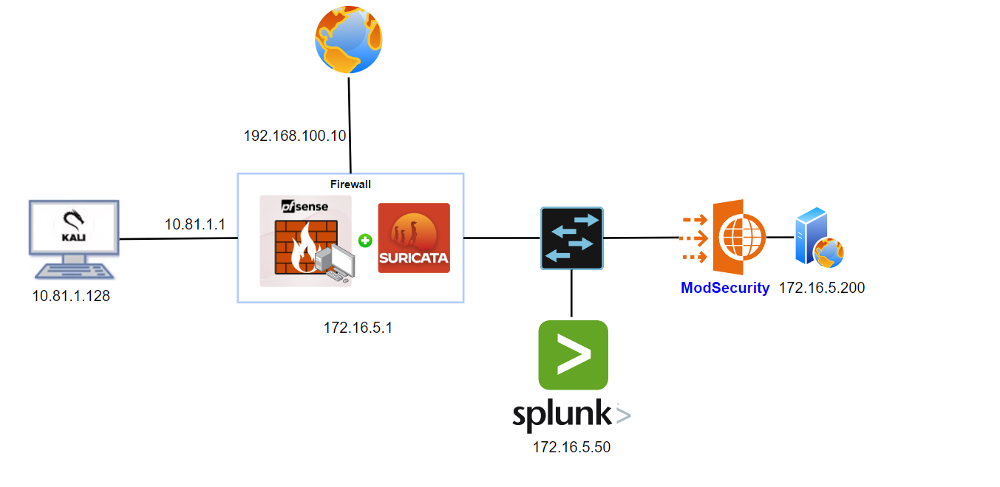

---

## Machine Information

| Machine       | Interface        | Network            | IP Address      |
| ------------- | ---------------- | ------------------ | --------------- |
| **Kali**      | eth0             | VMnet2 (Host-Only) | 10.81.1.128     |
| **pfSense**   | eth0 (WAN)       | NAT                | 192.168.100.10  |
|               | eth1 (OPT1/Kali) | VMnet2 (Host-Only) | 10.81.1.1       |
|               | eth2 (LAN)       | VMnet4 (Host-Only) | 172.16.5.1      |
| **Splunk**    | eth0             | NAT (optional)     | 192.168.100.130 |
|               | eth1             | VMnet4 (Host-Only) | 172.16.5.50     |
| **WebServer** | eth0             | VMnet4 (Host-Only) | 172.16.5.200    |

Here we separate traffic into three zones:

* **WAN (Internet access)** through NAT.
* **LAN (Internal business network)** where Splunk and the WebServer reside.
* **Kali (Attacker network)** isolated on its own subnet, but connected through pfSense so we can control and monitor attacks.

---

## 1. pfSense (Router/Firewall)

### Console Setup

When pfSense boots, accept the defaults. After initial configuration, we assign interfaces:

* **WAN → em0** (connected to Internet/NAT).
* **LAN → em2** (our internal protected network).
* **OPT1 → em1** (this will be renamed later as "Kali").

This segmentation mimics real enterprise setups: WAN for outside traffic, LAN for production, and a separate monitored network for attackers.

### Assigning IPs

Using **Option 2** in the console:

* **LAN (em2):**

  * IP: `172.16.5.20`
  * Subnet: `/24`
  * No gateway (since this is an internal segment).
  * DHCP: disabled for now.
  * HTTPS enabled for secure pfSense web UI access.

* **WAN (em0):**

  * IP: `192.168.100.10`
  * Gateway: `192.168.100.2` (default NAT gateway to Internet).

* **OPT1 (em1 – Kali):**

  * IP: `10.81.1.1`

At this stage, pfSense acts as the central router, separating and routing between networks.

---

## 2. Splunk Configuration

Splunk will live in the **LAN zone**, so we must point it to pfSense as its gateway.
We edit `/etc/netplan/50-vagrant.yaml`:

```yaml
network:
  version: 2
  renderer: networkd
  ethernets:
    ens33:
      dhcp4: false
      addresses:
        - 172.16.5.50/24
      nameservers:
        addresses: [8.8.8.8, 172.16.5.1]
      routes:
        - to: 0.0.0.0/0
          via: 172.16.5.1
          metric: 100
```

* **IP:** `172.16.5.50` (static LAN address).
* **Gateway:** `172.16.5.1` (pfSense LAN).
* **DNS:** Google DNS (`8.8.8.8`) + pfSense (`172.16.5.1`).

Apply with:

```bash
sudo netplan apply
```

This ensures Splunk can reach pfSense, resolve hostnames, and access the Internet.

---
## 3. Web server config
config network
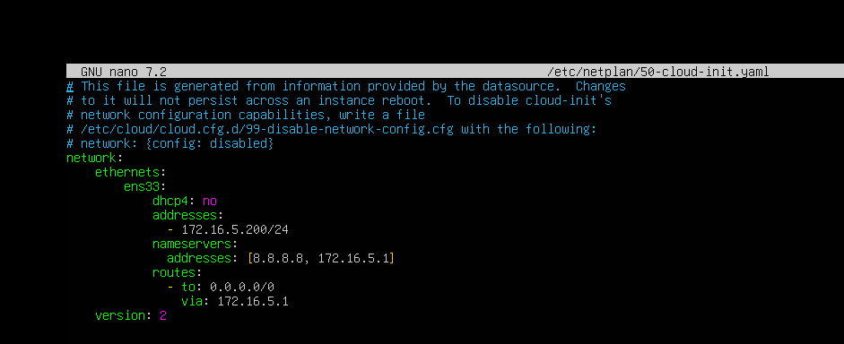
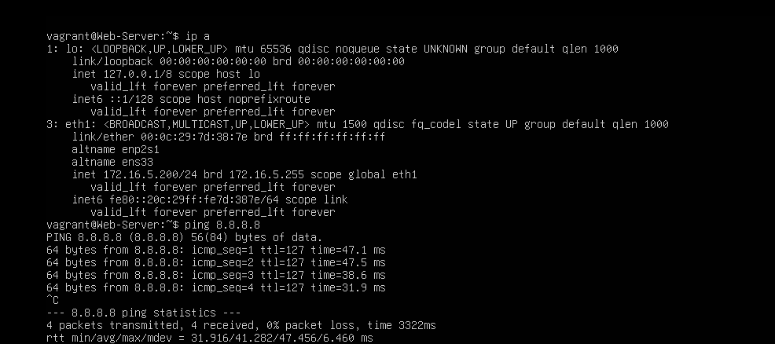

install dvwa
follow https://www.linkedin.com/pulse/installing-dvwa-damn-vulnerable-web-application-kali-linux-handaya-0j1sc/

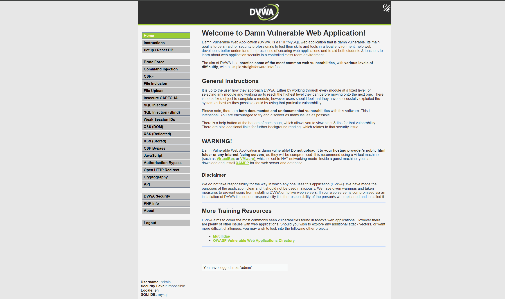
---

## 4. pfSense Web Interface

Access pfSense webConfigurator via **[https://172.16.5.1](https://172.16.5.1)**.
Login credentials: `admin / pfsense`.

### Wizard Setup

* **DNS servers:** `8.8.8.8` (primary), `4.4.4.4` (secondary).
* **Timezone:** set correctly.
* **Admin password:** change to something secure.
* Reload → apply changes.

This wizard initializes pfSense for first-time use.

---

## 5. Interface Settings in Web UI

Inside pfSense web UI:

* Rename **OPT1 → Kali** for clarity.
* Enable all three interfaces: **WAN, LAN, Kali**.
* On **WAN**, add a gateway (`192.168.100.2`) to enable Internet connectivity through NAT.

This makes pfSense aware of where to forward outbound traffic.

---

## 6. Firewall Rules

By default, pfSense applies:

* **LAN → Allow all outbound**.
* **OPT interfaces → Deny all traffic**.

To allow communication, we must explicitly permit rules.

### Rules to Add

* **Kali Interface (OPT1):**

  * Action: Pass
  * Protocol: Any
  * Source: Kali net (10.81.1.0/24)
  * Destination: Any

* **LAN Interface:**

  * Action: Pass
  * Protocol: Any
  * Source: LAN net (172.16.5.0/24)
  * Destination: Any

With these, both LAN and Kali networks can talk to pfSense and beyond.

---

## Test connection

After completing these steps:

* **Kali (10.81.1.128)** can ping LAN network via pfSense.


* **Splunk (172.16.5.50)** communicates with the WebServer.
  
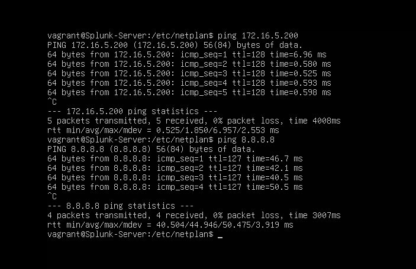

* **WebServer (172.16.5.200)** can be accessed internally for testing.


---

## Integration 


### Splunk and pfSense Integration

In enterprise environments, it is common to use **Syslog forwarding** from pfSense to Splunk for centralized logging and monitoring. Splunk can collect and parse logs from pfSense, giving SOC teams a clear view of firewall events, DHCP leases, VPN activity, and more.

#### Method 1: Configure Splunk with Raw Syslog Input

#### On Splunk

1. Go to **Settings > Data Inputs > UDP > Add new**

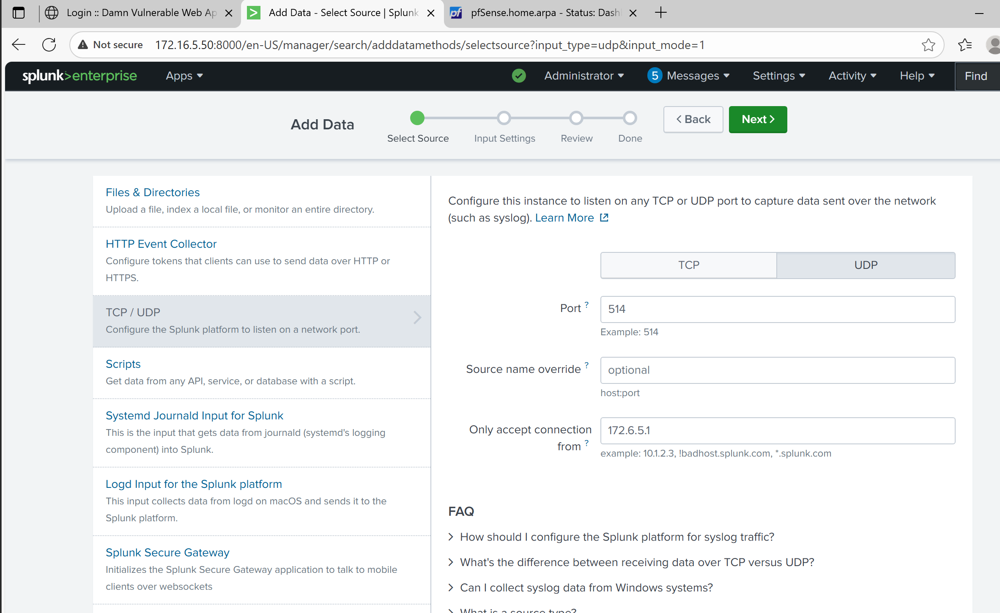

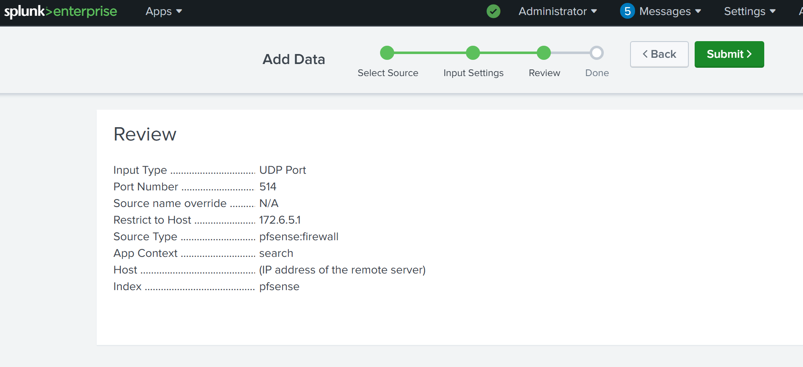

2. Or configure directly on the CLI:

```bash
cd /opt/splunk/etc/system/local/
sudo nano inputs.conf
```

Add the following block:

```conf
[udp://514]
connection_host = ip
sourcetype = pfsense:raw
index = pfsense
```

Restart Splunk:

```bash
sudo systemctl restart splunkd
```

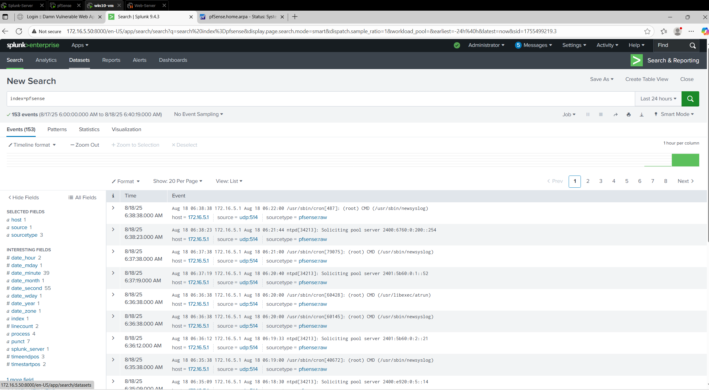

#### On pfSense

1. Navigate to **Status > System Logs > Settings**
   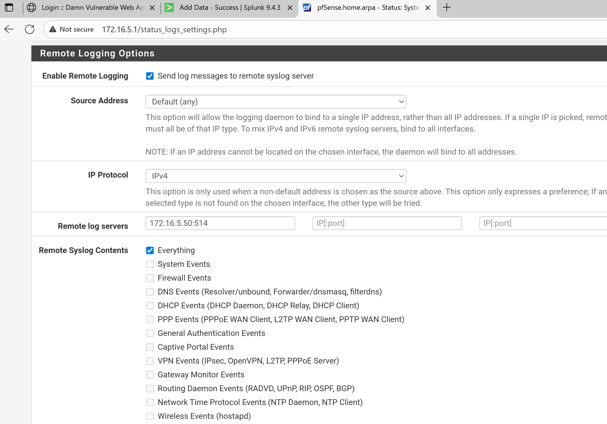

2. Enter the Splunk server’s IP and port (e.g., UDP 514).


**Result**: You will start receiving pfSense logs in Splunk. However, these logs will appear in **raw text format**. While you can search them, Splunk will not automatically parse fields such as `src_ip`, `dst_ip`, `protocol`, or `action`.

This method works, but it requires **manual field extractions** for advanced analysis.


#### Method 2: Using TA-pfSense for Structured Logs

Since pfSense generates many types of logs (firewall, DHCP, VPN, DNS, etc.), it is more efficient to use Splunk’s **Technology Add-on (TA-pfSense)**, which provides parsing rules and pre-built sourcetypes.

**Step 1: Install TA-pfSense on Splunk**

* Download the TA from GitHub:
  [https://github.com/barakat-abweh/ta-pfsense](https://github.com/barakat-abweh/ta-pfsense)

* On the Splunk UI:
  Go to **Apps > Manage Apps > Install app from file** and upload the `TA-pfsense-main.zip`.

* On the CLI:

```bash
cd /opt/splunk/etc/apps/TA-pfsense-main/default
sudo nano inputs.conf
```

Add configuration:

```conf
[udp://7001]
index = pfsense
sourcetype = pfsense
no_appending_timestamp = true
```

Restart Splunk:

```bash
sudo systemctl restart splunkd
```

**Step 2: Configure pfSense Logging**

1. Go to **Status > System Logs > Settings**.
2. Set **Log Messages format → syslog**.

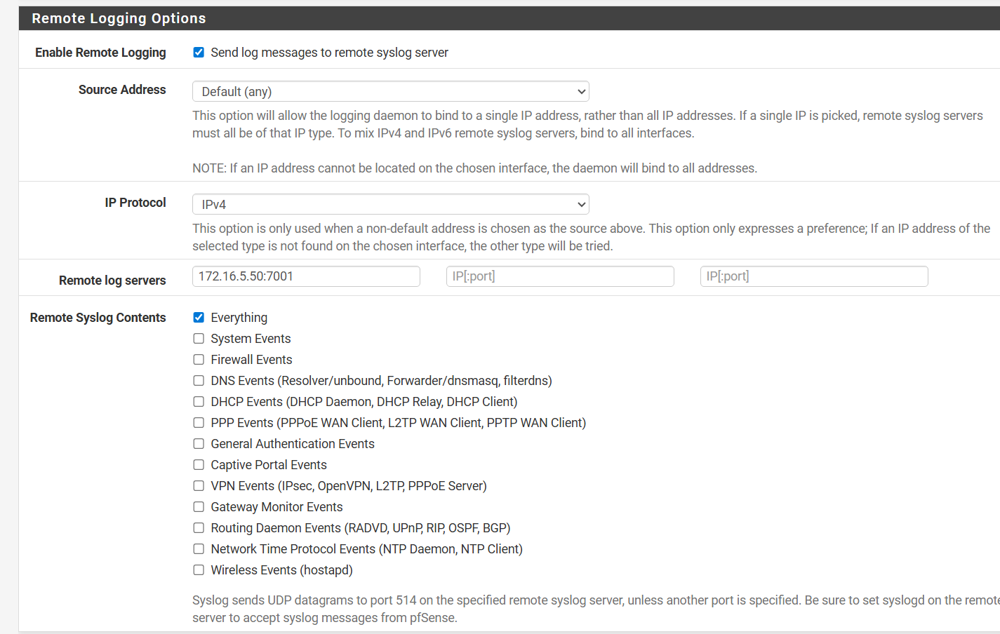

3. Verify the logs are forwarded:
   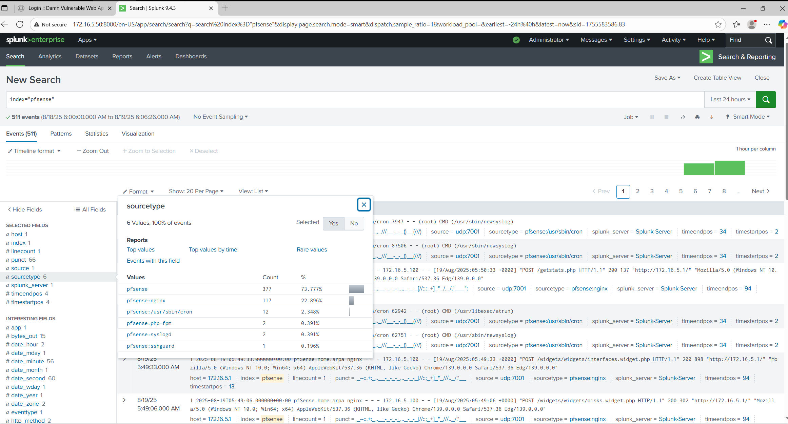

4. Logs should now be parsed automatically:
   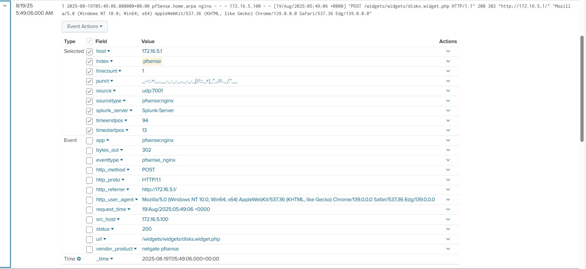


#### Method 3: Advanced Setup with syslog-ng (Optional)

For larger environments, you may not want pfSense to send all logs directly to Splunk. Instead, you can configure **syslog-ng** as an intermediary:

* pfSense → syslog-ng → Splunk.
* syslog-ng can:

  * **Filter logs** (e.g., send only firewall logs to Splunk).
  * **Reformat logs** for better parsing.
  * **Scale** across multiple pfSense instances.

This approach is often used in enterprise SOCs.

reference https://iritt.medium.com/setting-up-syslog-ng-on-pfsense-for-your-cybersecurity-home-lab-e74e55b33c49

You now have three ways to integrate pfSense with Splunk:

1. **Raw UDP input** – simple but unparsed.
2. **TA-pfSense app** – structured logs with pre-built sourcetypes and dashboards.
3. **syslog-ng relay** – enterprise-level filtering and scalability.


### Intergration splunk with web server 

Step 1: Install and setup Splunk universal Forwarder
1. Go to https://www.splunk.com/en_us/download/universal-forwarder.html and download the appropriate version for your operating system.

wget -O splunkforwarder-10.0.0-e8eb0c4654f8-linux-amd64.deb "https://download.splunk.com/products/universalforwarder/releases/10.0.0/linux/splunkforwarder-10.0.0-e8eb0c4654f8-linux-amd64.deb"

sudo dpkg -i splunkforwarder-10.0.0-e8eb0c4654f8-linux-amd64.deb

Splunk UF is often installed on /opt/splunkforwarder/

step 2: accept the license
cd /opt/splunkforwarder/bin
sudo ./splunk start --accept-license

create user when prompted

Step 3: Configure the Forwarder
On UI of Splunk 
1. Go to Settings > Forwarding and Receiving > Configure Receiving > Add New
2. Chose 9997

Step 4: connect the Forwarder to Splunk
cd /opt/splunkforwarder/bin
sudo ./splunk add forward-server <IP_Indexer>:9997 -auth admin:yourpassword

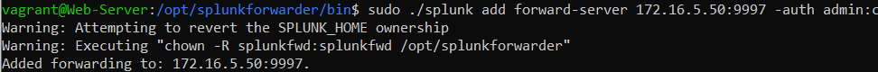

check
./splunk list forward-server

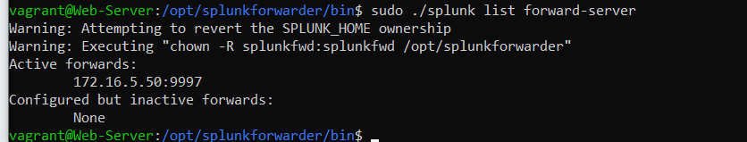

Step 5: Collect Apache logs

By default apache logs are located at /var/log/apache2/access.log and /var/log/apache2/error.log

add inputs.conf
sudo nano /opt/splunkforwarder/etc/system/local/inputs.conf

[monitor:///var/log/apache2/access.log]
sourcetype = apache:access
index = web_access

[monitor:///var/log/apache2/error.log]
sourcetype = apache:error
index = web_error

step 6: Restart the Forwarder
sudo /opt/splunkforwarder/bin/splunk restart

search index=web_access or index=web_error
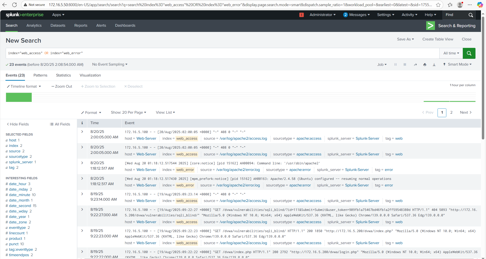

---
### Config and Integration with Suricata

---
### Integration with ModSecurity
1. Install ModSecurity
Update software repos:
sudo apt update -y
Download and install the ModSecurity Apache module:
sudo apt install libapache2-mod-security2
Type Y.
Restart the Apache service:
sudo systemctl restart apache2 
Ensure the installed software version is at least 2.9:
apt-cache show libapache2-mod-security2 

2. Configure ModSecurity
ModSecurity is set to detect and log suspicious events only by default. Below we’ll configure it to detect and block suspicious activity.

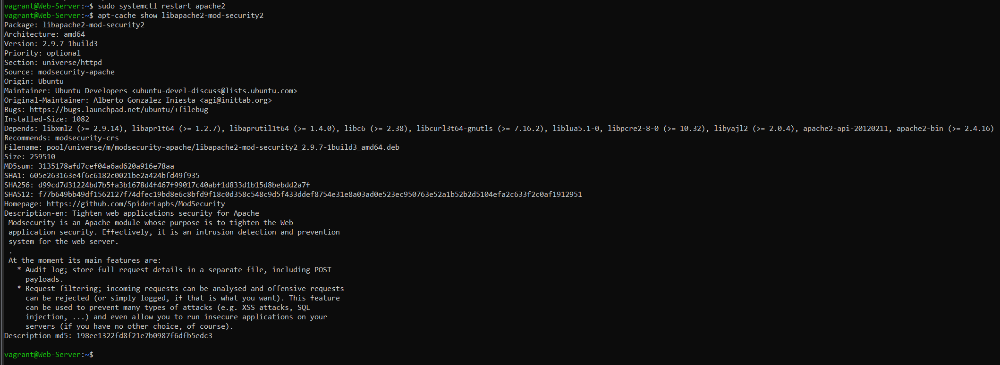

Copy the default ModSecurity configuration file to a new file:
sudo cp /etc/modsecurity/modsecurity.conf-recommended /etc/modsecurity/modsecurity.conf
Edit the ModSecurity configuration file with Vi, Vim, Emacs, or Nano.
sudo nano /etc/modsecurity/modsecurity.conf
Near the top of the file, you’ll see SecRuleEngine DetectionOnly. Change DetectionOnly to On.
Save changes.
Restart Apache:
systemctl restart apache2 

3. Download OWASP Core Rule Set

cd /etc/modsecurity/
sudo git clone https://github.com/coreruleset/coreruleset.git
cd coreruleset
sudo cp crs-setup.conf.example crs-setup.conf

add rule onto apache config
sudo nano /etc/apache2/mods-enabled/security2.conf

add end file
IncludeOptional /etc/modsecurity/coreruleset/crs-setup.conf
IncludeOptional /etc/modsecurity/coreruleset/rules/*.conf


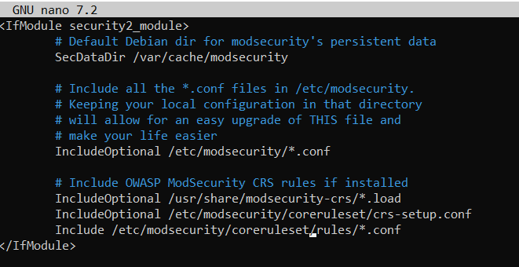

sudo systemctl restart apache2

4. Can’t Restart Apache

If Apache fails to restart, check the status for error information:
systemctl status apache 
For this example, I received the error: AH00526: Syntax error on line 845 of /etc/modsecurity/crs/crs-setup.conf. To resolve this error, edit the Apache security configuration file again:
/etc/apahc2/mods-enabled/security2.conf
Comment out this file path by adding a # in the beginning of the line: # IncludeOptional /usr/share/modsecurity-crs/owasp-crs.load.
Save changes.
Apache should now restart successful:
systemctl restart apache2

5. Test ModSecurity Configuration
Edit your default Apache configuration file:
sudo nano /etc/apache2/sites-available/000-default.conf
At the bottom of the file, above </VirtualHost>, add the following custom ModSecurity rule:
SecRuleEngine On
SecRule ARGS:testparam "@contains test" "id:999,deny,status:403,msg:'Test Successful'"
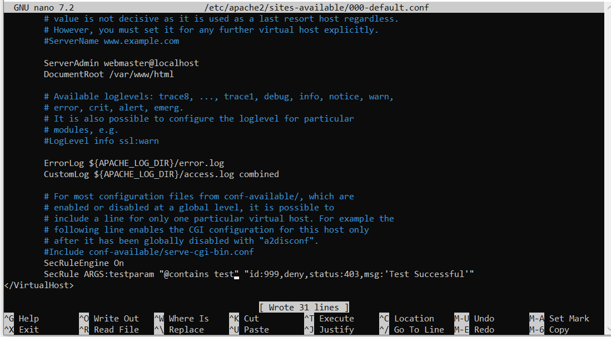

Save changes.
Restart Apache:
systemctl restart apache2
In your browser, attempt to access a URL on that server with ?testparam=test on the end (e.g. domain.com/?testparam=test).
You should receive a 403 Forbidden error.

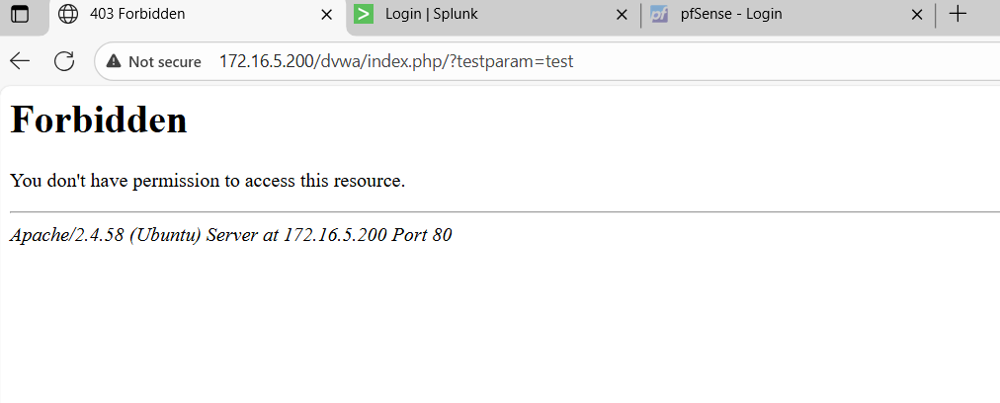

You can confirm this by searching your Apache error log for ModSecurity errors using your error message (“Test Successful”) or id number (999):
cat /var/log/apache2/error.log | grep 'Test Successful'

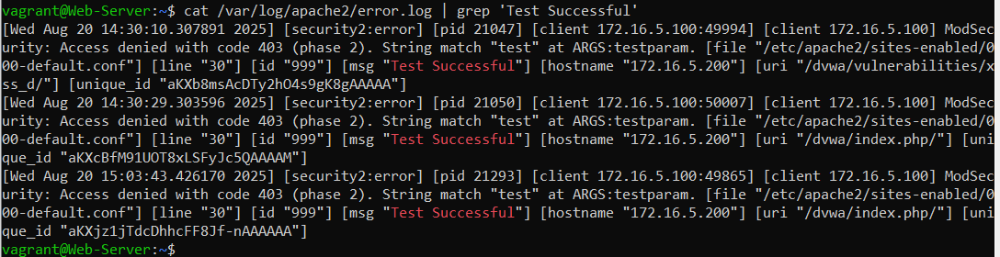

refer https://www.inmotionhosting.com/support/server/apache/install-modsecurity-apache-module/#ubuntu

6. Send log to splunk
sudo nano /opt/splunkforwarder/etc/system/local/inputs.conf

[monitor:///var/log/apache2/modsec_audit.log]
index = waf 
sourcetype = modsecurity:audit

sudo /opt/splunkforwarder/bin/splunk restart
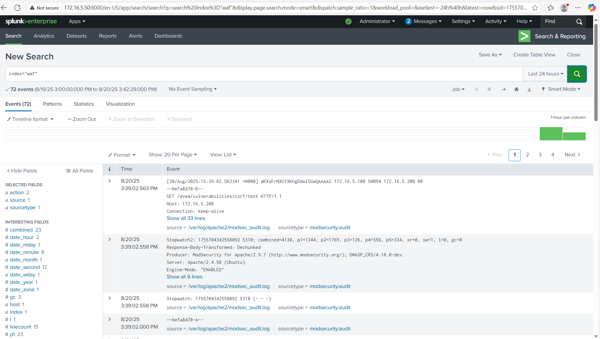


